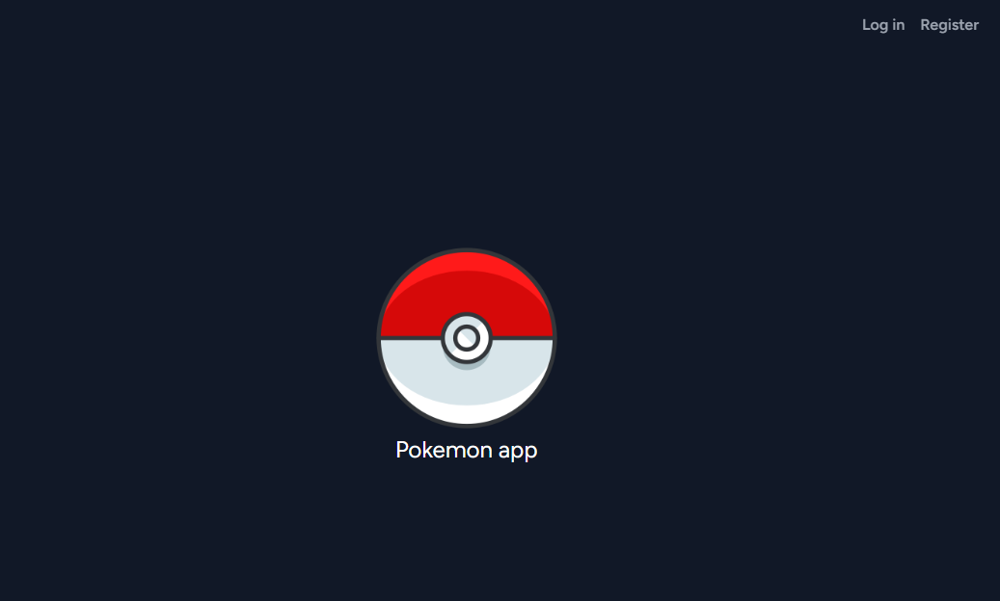
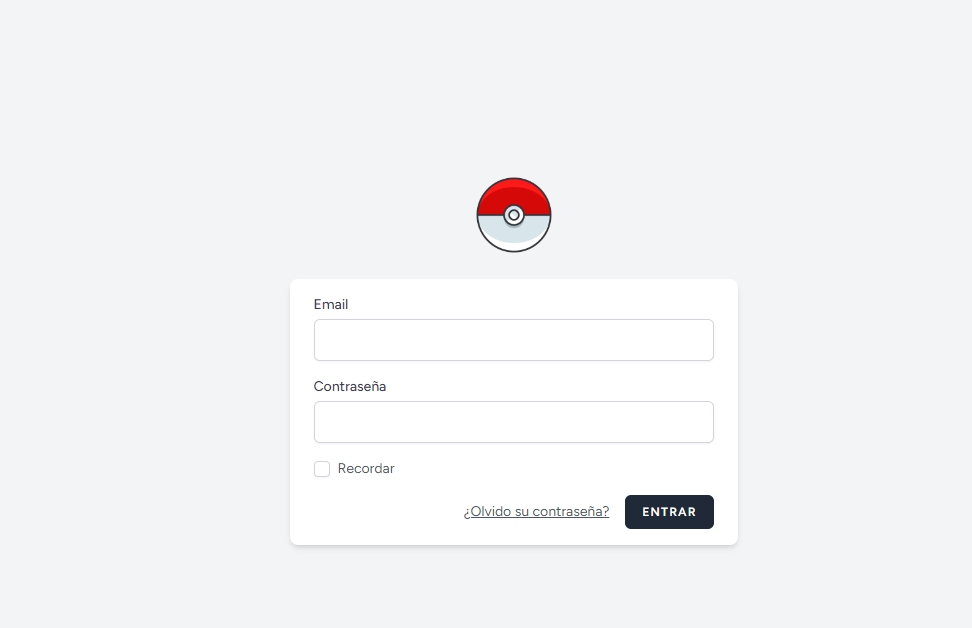
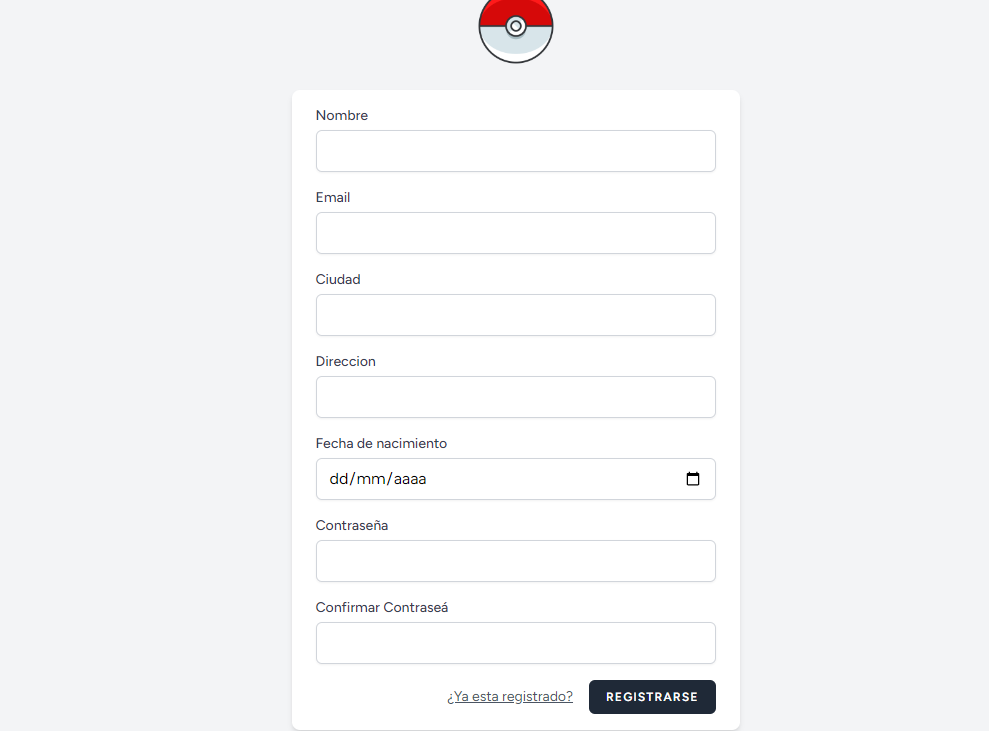
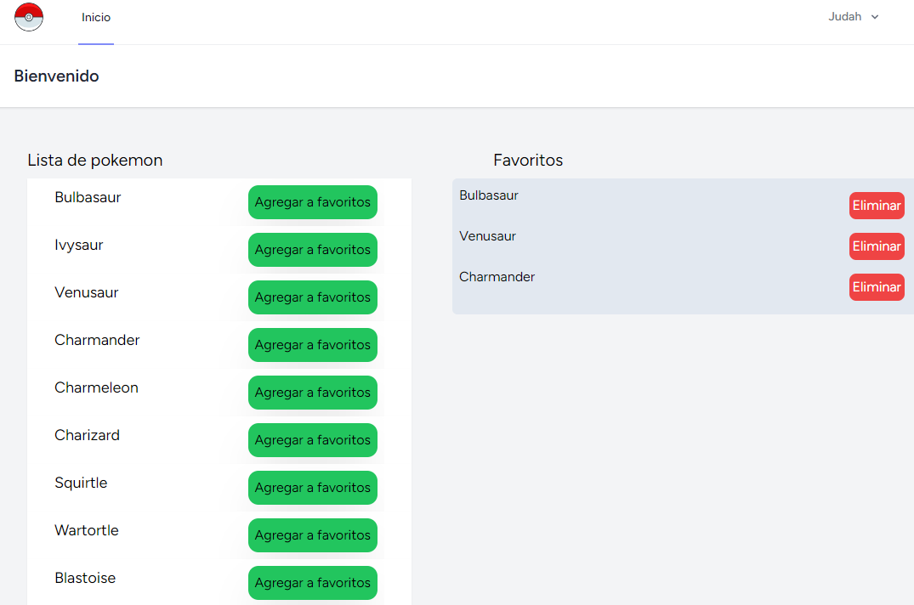
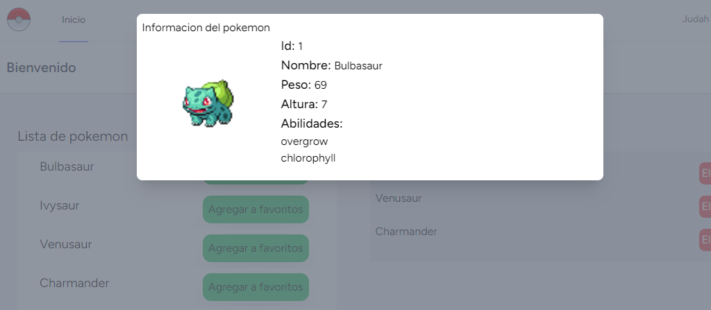

# Prueba tecnica Netgrid

## Descripcion

Aplicacion web que ofrece inicio de sesion y registro de usuario, y establecer pokemones favoritos desde una api externa

## Tecnologias usadas

* PHP con el framework Laravel
* VueJS
* TailwindCSS
* Base de datos MariaDB

## Screenshots
Inicio

Login

Registrarse

Sesion de suario

Consultar informacion del pokemon

